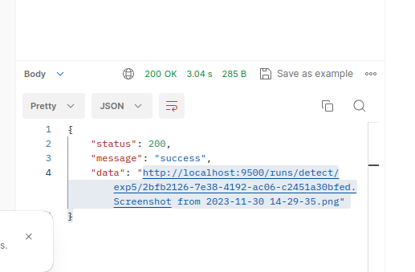

## Download packages
1. Download and extract to current directory  
https://drive.google.com/file/d/14YaGtsz_A0bm3XvBvKBsGP3X4CXtLlpK/view?usp=sharing
2. Download and move to ./widerface_evaluate directory
https://drive.google.com/drive/folders/1bK5u4MWsgpmeJN7Jdom9PXiN0nASfI3o?usp=sharing  

## Install docker container toolkit
https://docs.nvidia.com/datacenter/cloud-native/container-toolkit/latest/install-guide.html 

## run server AI
```
docker run --rm --name rabbitmq -p 5672:5672 -p 15672:15672 rabbitmq:management
docker run --rm --gpus all --network host -it -w /home -v $(pwd):/home --name msh phamvandan/torchenv:latest
python3 main_app.py
```

## run client to train, test, inference
You can run directly in your local env, no need to build docker becase it only use request lib python
```
python3 main_client.py
```
**Be note that uncomment to run what you want**
- there are 3 model_type: yolos, yolon, yolon5
- there are 3 dataset_type: face_mask, wild01, lfwd 
- each training should have difference train_id
- results of detect phase can be download from link return
  

**Dataset info**
```
dataset face detection (train, val, test)
face_mask 3554, 398, 173
wild01 1000  500 200
lfwd 1000 250 150
```