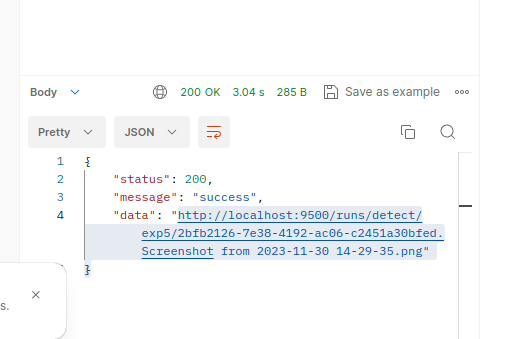

## Run websocket server AI
```
cd ./msh_face_det
docker build . -t torchenv
docker run --gpus all -it -w /home -v $(pwd):/home --name msh torchenv:latest
python3 ws_main_app.py
```

## Run websocket client to call train, test, inference 
You can run directly in your local env, no need to build docker becase it only use little lib python  
*Open first terminal*
```
pip install aiohttp python-socketio
python3 ws_main_client.py
```
*Open second terminal*
```
curl http://127.0.0.1:9600/infer
curl http://127.0.0.1:9600/test
curl http://127.0.0.1:9600/train
```  
*Go back to first terminal and wait for train, test, infer results*

**Example training results**
```
Recieved from server: {"response": {"epochs": 0, "training_status": 1, "map0.5": 0.7958663697108727, "map0.95": 0.3865548287244467, "loss": 0.03614009544253349, "weight_path": "runs/train/exp22/weights/best.pt"}, "labId": "lab_001", "trainId": "train_2024_001"}
Recieved from server: {"response": {"epochs": 1, "training_status": 0, "map0.5": 0.7922718845268657, "map0.95": 0.37505566702873083, "loss": 0.03663509711623192, "weight_path": "runs/train/exp22/weights/best.pt"}, "labId": "lab_001", "trainId": "train_2024_001"}
```
**Example testing results**
```
Recieved testing results from server: {"response": {"map0.5": 0.8467606360508344, "map0.95": 0.4450472861656044, "weight_path": "weights/yolov5s-face.pt"}, "labId": "lab_002", "testId": "test_2024_002"}
```

**Be note that, we have**
- there are 3 backbone: yolos, yolon, yolon5
- there are 3 dataset_type: face_mask, wild01, lfwd 
- results of detect phase can be download from link return
  

**Dataset info**
```
dataset face detection (train, val, test)
face_mask 3554, 398, 173
wild01 1000  500 200
lfwd 1000 250 150
```

